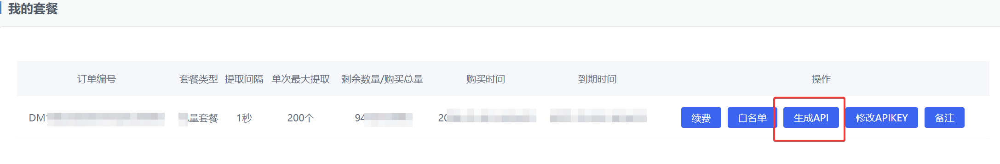

# socks5forward

用Rust重构 https://github.com/kaliworld/socks5proxy/commits/main/ 的 Rust 的本地 SOCKS5 流量转发器，通过拉取解析 https://www.dmdaili.com/ 中的付费代理池，将本机的流量随机分配到代理池中。可以轻松集成第三方工具，将攻击流量代理到代理池中，可用于自动化扫描或者手工测试，规避WAF的禁封ip。

## 申请付费的Api

官方购买套餐后拿到apikey和pwd密钥，下面这个地方找到密钥，套餐还算可以，如果没跑路的话应该能用好几年：




## 默认设计

- 默认本地监听SOCKS5 127.0.0.1:9999
- 每隔 30 秒刷新一次上游 SOCKS5 代理池
- 健康机制检查，并在失败时自动熔断和切换其他健康代理
- 支持 IPv4 / IPv6 / 域名 格式

## 快速使用

默认使用：

```bash
socks5forward --apikey xxxx --pwd xxxxx --getnum 60 --listen 127.0.0.1:9999
```

## 支持的命令参数

- `--apikey`：API key
- `--pwd`：API password
- `--getnum`：每次拉取的代理数量，默认 `60`
- `--listen`：本地 SOCKS5 监听地址，默认 `127.0.0.1:9999`
- `--api-url`：代理 API 地址，默认 `http://need1.dmdaili.com:7771/dmgetip.asp`
- `--refresh-secs`：刷新代理池间隔，默认 `30`
- `--request-timeout-secs`：请求 API 的超时时间，默认 `10`
- `--connect-attempts`：每个入站连接最多尝试多少个上游代理，默认 `5`
- `--upstream-timeout-secs`：单个上游代理建立连接和 SOCKS5 握手超时，默认 `8`

## 运行日志

默认日志级别为 `info`。如需更详细日志：

```bash
RUST_LOG=debug cargo run --release -- --apikey xxx --pwd yyy
```
